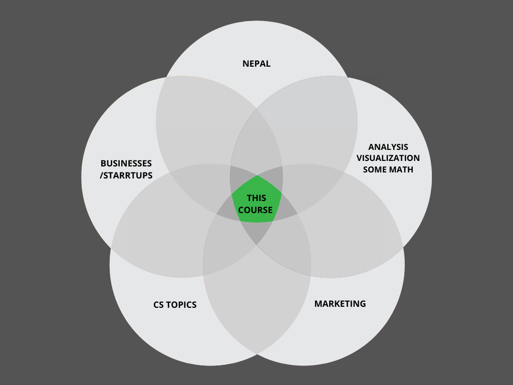

# Week 1 Agenda

- Introductions
- Icebreakers
  - Introduce yourself without mentioning your academic/work background.
  - Give us a scenario where you have used data/analytics to make a decision. (data != numbers)
  - Break the rules above and tell us about yourself as you wish. (do not make it generic) 
- Introduction to the curriculum (a walkthrough)
  - What is this course? And, also importantly, what is not this course?
  - Business Intelligence vs Business Analytics vs Data Analytics vs Machine Learning vs Data Science
  - Objectives, Outcomes of the course
  - Definition, Context, Process, Use Cases 
  - Data driven decision making 
  - Decision Support Systems (Database/Datasource, Model, UI)
  - Statistics (descriptive and inferential)
  - Data Visualizations with different tools
  - EDA with different tools (primariliy on Sheets)
  - Time Series Analysis
  - Descriptive, Diagnostic, Predictive, Prescriptive analysis
- shrink 12 weeks to 10 weeks

# Business Intelligence (British College, 2021 Fall)

## Objectives
1. To ensure students understand the concepts of business analytics and data visualization
2. To develop students' knowledge, understanding. and skills in the real life scenario tackling real world business problems using data
3. To ensure students learn practical skills leveraging few essential tools
	
	
## Outcomes
1. Understand the essentials of business intelligence, statistics and the corresponding terminologies.
2. Be able to create data visualizations using spreadsheets/tableau.
3. Be able to interpret real world problems using data.
4. Be familiar with the steps involved in the BI process.
5. Be able to interact competently on the topic of BI.
6. Have had some hands-on experience in using BI techniques.

## Tools
- Google Sheets/Excel, 
- Tableau 
- Github
- Basic Python and Pandas (if participants want)

# Weekly Breakdown

| Week #  | Topics Covered                                                                                                                                                                                                                           |
| ------- | ---------------------------------------------------------------------------------------------------------------------------------------------------------------------------------------------------------------------------------------- |
| Week 1  | Introduction to BI (Definition, Context, Process, Use Cases)                                                                                                                                                                             |
| Week 2  | Decision Making and Decision Support Systems Discuss the decision making challenges faced by different managers Discuss various DSS and its evolution                                                                              |
| Week 3  | Introduction to Business Metrics, KPIs Become familiar with business metrics used by business analysts in the area of marketing, sales, growth, engagement, and financial analysis Calculate and interpret key performance metrics |
| Week 4  | Business statistics Basic statistics Types of visualization Interpreting visualization Good visualization                                                                                                                    |
| Week 5  | Descriptive Analysis with Excel/Google Sheets Fundamentals of data and statistics with use case                                                                                                                                       |
| Week 6  | Descriptive Analysis with Excel/Google Sheets Fundamentals of data and statistics with use case                                                                                                                                       |
| Week 7  | Time Series Analysis, Simple Regression, Trends, Seasonality concepts with relevant instances                                                                                                                                            |
| Week 8  | Design Principles Tableau Basics Telling stories with Tableau                                                                                                                                                                      |
| Week 9  | Workshop on building Tableau Dashboard                                                                                                                                                                                                   |
| Week 10 | Workshop on building Tableau Dashboard                                                                                                                                                                                                   |
| Week 11 | Diagnostic analysis Predictive analysis Prescriptive analysis                                                                                                                                                                      |
| Week 12 | Current trends in Business Intelligence (Machine Learning, AI)                                                                                                                                                                           |
| Week 13 | More real life use cases, Ending Notes and Finishing Projects                                                                                                                                                                            |

- Tools
  - [x] Github
  - [x] Google Sheets
  - [x] Tableau
  - [ ] Canva ?
  - [ ] Google Colab/Python ?
- Assignments and readings
- Attendence / Virtual classroom etiquette
- Lets add/subtract/develop the curriculum further (upon concensus)  
- Case studies

## Potpourri Terminilogies (will be added thoughout the course)
- [ ] A/B testing
- [ ] Ad Hoc Query
- [ ] Agile
- [ ] Anonymization
- [ ] API
- [ ] AWS Quicksight, Tableau, Power BI, Datastudio
- [ ] Backend
- [ ] Biases
- [ ] Big Data
- [ ] Bots
- [ ] Brand Awareness+Equity+Loyalty
- [ ] Business driver
- [ ] Call to action
- [ ] Channel
- [ ] Churn
- [ ] Cloud
- [ ] Columnar Database
- [ ] Competitive Analysis
- [ ] Conversion
- [ ] Correlation
- [ ] CRO (Conversion Rate Optimization)
- [ ] Customer Lifetime Value
- [ ] Dashboard
- [ ] Data Engineering
- [ ] Data Lake
- [ ] Data Mart
- [ ] Data Pipeline
- [ ] Data Scraping
- [ ] Data Storytelling
- [ ] Data Warehouse
- [ ] Data Wrangling
- [ ] Database
- [ ] Demand Generation
- [ ] Demography
- [ ] Denormalization
- [ ] DevOps
- [ ] Dimensions and measures
- [ ] Discrete, Continious, Categorical, Ordinal Data
- [ ] Domain knowledge
- [ ] Due Deligence 
- [ ] Equity
- [ ] ETL
- [ ] EDA
- [ ] Forecasting
- [ ] Funnels
- [ ] Git
- [ ] Goals
- [ ] Grant funding
- [ ] Hadoop, Spark etc
- [ ] Heuristics
- [ ] Impressions
- [ ] In-Memory BI
- [ ] Infographic
- [ ] Inmom
- [ ] Joins
- [ ] Kimball
- [ ] KPIs
- [ ] Leads
- [ ] Lookalike audiences
- [ ] Metadata
- [ ] Metrics
- [ ] Mission
- [ ] Near Real Time
- [ ] Normal distribution
- [ ] Normalization
- [ ] NPS
- [ ] OKRs
- [ ] OLAP
- [ ] OLTP
- [ ] Pandas, Tidyverse, PySpark
- [ ] Pareto
- [ ] Pirate Metrics 
- [ ] Qualatitive data
- [ ] Quantitative data
- [ ] Real Time
- [ ] RDBMS
- [ ] Roadmap
- [ ] ROI
- [ ] Runway period
- [ ] SaaS
- [ ] Schema
- [ ] Seasonality
- [ ] Single source of truth
- [ ] Spreadsheets
- [ ] Snapshot
- [ ] SQL
- [ ] Star Schema
- [ ] Surveys
- [ ] Synthetic Data
- [ ] Targets
- [ ] Trend
- [ ] Unstructured data and semi structured data
- [ ] Unique Value Preposition
- [ ] Valuation
- [ ] View
- [ ] Vision
- [ ] Volume, Velocity, Variety, Veracity, Variability

## Definition
## Context
## Process
## Use Cases 
