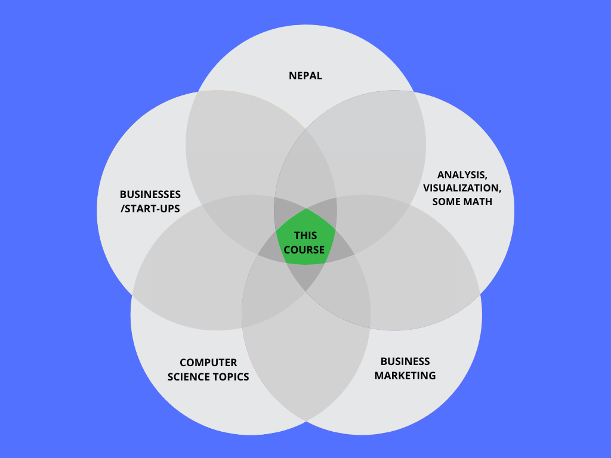

# Business Intelligence (British College, 2021 Fall)

## Objectives
1. To ensure students understand the concepts of business analytics and data visualization
2. To develop students' knowledge, understanding. and skills in the real life scenario tackling real world business problems using data
3. To ensure students learn practical skills leveraging few essential tools
	
	
## Outcomes
1. Understand the essentials of business intelligence, statistics and the corresponding terminologies.
2. Be able to create data visualizations using spreadsheets/tableau.
3. Be able to interpret real world problems using data.
4. Be familiar with the steps involved in the BI process.
5. Be able to interact competently on the topic of BI.
6. Have had some hands-on experience in using BI techniques.

## Tools
- Google Sheets/Excel, 
- Tableau 
- Github
- Basic Python and Pandas (if participants want)

# Weekly Breakdown
| Week #  | Topics Covered                                                                                                                                                                                                                           |
| ------- | ---------------------------------------------------------------------------------------------------------------------------------------------------------------------------------------------------------------------------------------- |
| Week 1  | Introduction to BI (Definition, Context, Process, Use Cases)                                                                                                                                                                             |
| Week 2  | Decision Making and Decision Support Systems Discuss the decision making challenges faced by different managers Discuss various DSS and its evolution                                                                              |
| Week 3  | Introduction to Business Metrics, KPIs Become familiar with business metrics used by business analysts in the area of marketing, sales, growth, engagement, and financial analysis Calculate and interpret key performance metrics |
| Week 4  | Business statistics Basic statistics Types of visualization Interpreting visualization Good visualization                                                                                                                    |
| Week 5  | Descriptive Analysis with Excel/Google Sheets Fundamentals of data and statistics with use case                                                                                                                                       |
| Week 6  | Descriptive Analysis with Excel/Google Sheets Fundamentals of data and statistics with use case                                                                                                                                       |
| Week 7  | Time Series Analysis, Simple Regression, Trends, Seasonality concepts with relevant instances                                                                                                                                            |
| Week 8  | Design Principles Tableau Basics Telling stories with Tableau                                                                                                                                                                      |
| Week 9  | Workshop on building Tableau Dashboard                                                                                                                                                                                                   |
| Week 10 | Current trends in BI, ending notes, complete projects, wrap up                                                                                                                                                                           |

## Potpourri Terminilogies (will be added thoughout the course)
- [ ] A/B testing
- [ ] ACID compliancy
- [ ] Ad Hoc Query
- [ ] Agile
- [x] Anonymization
- [ ] API
- [x] AWS Quicksight, Tableau, Power BI, Datastudio
- [ ] Backend
- [x] Batch processing vs streaming
- [x] Biases
- [x] Big Data
- [x] Bots
- [ ] Brand Awareness+Equity+Loyalty
- [ ] Business driver
- [ ] Call to action
- [x] Channel
- [x] Churn
- [x] Cloud
- [ ] Columnar Database
- [x] Competitive Analysis
- [ ] Conversion
- [x] Correlation
- [ ] CRO (Conversion Rate Optimization)
- [ ] Customer Lifetime Value
- [x] Dashboard
- [ ] Data Engineering
- [x] Data Lake
- [x] Data Mart
- [ ] Data Pipeline
- [ ] Data Scraping
- [x] Data Storytelling
- [x] Data Warehouse
- [x] Data Wrangling
- [x] Data Cleansing, Referential integrity, Domain integrity, Entity integrity
- [x] Database
- [ ] Demand Generation
- [x] Demography
- [x] Denormalization
- [ ] DevOps
- [ ] Dimensions and measures
- [x] Discrete, Continious, Categorical, Ordinal Data
- [x] Domain knowledge
- [ ] Due Deligence 
- [ ] Equity
- [x] ETL
- [x] EDA
- [x] Forecasting
- [x] Funnels
- [x] Git
- [ ] Goals
- [ ] Grant funding
- [ ] Hadoop, Spark etc
- [x] Heuristics
- [ ] Impressions
- [ ] In-Memory BI
- [x] Infographic
- [x] Joins
- [ ] KPIs
- [x] Leads
- [ ] Lookalike audiences
- [ ] Metadata
- [x] Metrics
- [ ] Mission
- [ ] Near Real Time
- [x] Normal distribution
- [x] Normalization
- [ ] Net Promoter Score
- [ ] OKRs
- [x] OLAP
- [X] OLTP
- [x] Pandas, Tidyverse, PySpark
- [x] Pareto
- [x] Pirate Metrics 
- [x] Qualatitive data
- [x] Quantitative data
- [x] Real Time
- [x] RDBMS
- [x] Roadmap
- [ ] ROI
- [x] Runway period
- [ ] SaaS
- [x] Schema
- [x] Seasonality
- [x] Single source of truth
- [x] Semi structured data
- [x] Structured data
- [x] Spreadsheets
- [ ] Snapshot
- [x] SQL
- [x] Surveys
- [x] Synthetic Data
- [x] Trend
- [x] Unstructured data
- [x] Unique Value Preposition
- [ ] Valuation
- [ ] View
- [ ] Vision
- [x] Volume
- [x] Velocity
- [x] Variety
- [x] Veracity
- [x] Variability

## Don't worry, some of the acronyms confuse everyone

Source: https://www.perdoo.com/resources/merkel-asks-what-does-okr-mean/

## Dataset
## eHamroPasalmandu.com (we will be using a fake dataset for this fake ecommerce startup in nepal, see the datasets folder)

# Tables
- clients table
- items table
- transactions table
- merged (complete transactions table)

### clients table sample

| client\_id | name             | gender | dob        | email                          | phone      | channel       | first\_contact | lat     | lon     | location\_name              | created\_at |
| ---------- | ---------------- | ------ | ---------- | ------------------------------ | ---------- | ------------- | -------------- | ------- | ------- | --------------------------- | ----------- |
| 100000000  | Kaushal Bashyal  | Male   | 14/03/2003 | kaushal.bashyal@fakeemail.com  | 9841791565 | Google Search | browser        | 27.7768 | 85.3622 | Golfutar Main Rd            | 48:09.8     |
| 100000001  | Sona Hayanju     | Female | 03/07/1996 | sona.hayanju@fakeemail.com     | 9841685812 | Other         | browser        | 27.6954 | 85.3447 | ACE Institute Of Management | 46:03.5     |
| 100000002  | Suman Pokherel   | Male   | 04/08/2005 | suman.pokherel@fakeemail.com   | 9841526187 | Facebook/Ads  | browser        | 27.659  | 85.368  | Changathali Rd              | 05:06.3     |
| 100000003  | Samita Yogol     | Female | 22/08/2001 | samita.yogol@fakeemail.com     | 9841131562 | Facebook/Ads  | browser        | 27.7126 | 85.283  | Ring Road                   | 56:28.8     |
| 100000004  | Mahima Marasaini | Female | 20/03/1985 | mahima.marasaini@fakeemail.com | 9841859344 | Other         | app            | 27.7137 | 85.3245 | Bhagawati Marg              | 06:58.6     |

### items table sample

| **item\_id** | **item\_name**                                                                  | **price** | **category** | **image\_url**                                                                                                                                                                                                                                                     | **inventory** |
| ------------ | ------------------------------------------------------------------------------- | --------- | ------------ | ------------------------------------------------------------------------------------------------------------------------------------------------------------------------------------------------------------------------------------------------------------------ | ------------- |
| **10000**    | iPhone 12 (256GB)                                                               | 152900    | Phone        | [https://dummyimage.com/600x400/000/fff&text=iPhone+12+(256GB)](https://dummyimage.com/600x400/000/fff&text=iPhone+12+(256GB))                                                                                                                                     | 36            |
| **10001**    | VivoBook 14 X415JA (14” FHD, Intel i7-1065G7, Intel UHD, 8GB, 512GB SSD)        | 115000    | Laptop       | [https://dummyimage.com/600x400/000/fff&text=VivoBook+14+X415JA+(14”+FHD,+Intel+i7-1065G7,+Intel+UHD,+8GB,+512GB+SSD)](https://dummyimage.com/600x400/000/fff&text=VivoBook+14+X415JA+(14%E2%80%9D+FHD,+Intel+i7-1065G7,+Intel+UHD,+8GB,+512GB+SSD))               | 39            |
| **10002**    | Helios 300 2020 (15.6″ FHD 144Hz, Core i7-10750H, GTX 1660 Ti, 16GB, 512GB SSD) | 190000    | Laptop       | [https://dummyimage.com/600x400/000/fff&text=Helios+300+2020+(15.6″+FHD+144Hz,+Core+i7-10750H,+GTX+1660+Ti,+16GB,+512GB+SSD)](https://dummyimage.com/600x400/000/fff&text=Helios+300+2020+(15.6%E2%80%B3+FHD+144Hz,+Core+i7-10750H,+GTX+1660+Ti,+16GB,+512GB+SSD)) | 27            |
| **10003**    | Sony Alpha A6500 (With 18-135mm zoom lens)                                      | 245000    | Camera       | [https://dummyimage.com/600x400/000/fff&text=Sony+Alpha+A6500+(With+18-135mm+zoom+lens)](https://dummyimage.com/600x400/000/fff&text=Sony+Alpha+A6500+(With+18-135mm+zoom+lens))                                                                                   | 71            |
| **10004**    | iPhone SE 2 (256GB)                                                             | 96000     | Phone        | [https://dummyimage.com/600x400/000/fff&text=iPhone+SE+2+(256GB)](https://dummyimage.com/600x400/000/fff&text=iPhone+SE+2+(256GB))                                                                                                                                 | 24            |

### transactions table sample

| **created\_at**                | **item\_id** | **client\_id** |
| ------------------------------ | ------------ | -------------- |
| **2020-09-01 09:49:12.285421** | 10142        | 100000015      |
| **2020-09-01 16:44:09.888896** | 10113        | 100000010      |
| **2020-09-01 22:40:07.678792** | 10105        | 100000010      |
| **2020-09-02 18:48:22.620671** | 10177        | 100000022      |
| **2020-09-02 11:04:38.703035** | 10039        | 100000019      |

### merged table sample

| **item\_id** | **client\_id** | **created\_at**            | **name**             | **gender** | **dob**    | **email**                                                                       | **phone**  | **channel**   | **first\_contact** | **lat** | **lon** | **location\_name** | **created\_at\_client**    | **item\_name**                                                           | **price** | **category** | **image\_url**                                                                                                                                                                                                                                       | **inventory** |
| ------------ | -------------- | -------------------------- | -------------------- | ---------- | ---------- | ------------------------------------------------------------------------------- | ---------- | ------------- | ------------------ | ------- | ------- | ------------------ | -------------------------- | ------------------------------------------------------------------------ | --------- | ------------ | ---------------------------------------------------------------------------------------------------------------------------------------------------------------------------------------------------------------------------------------------------- | ------------- |
| **10001**    | 100000127      | 2020-09-06 16:03:41.236993 | Pralhad Biskiwakarma | Male       | 2002-05-25 | [pralhad.biskiwakarma@fakeemail.com](mailto:pralhad.biskiwakarma@fakeemail.com) | 9841968059 | Word of Mouth | app                | 27.712  | 85.322  | Hattisar Sadak     | 2020-09-06 04:41:23.065429 | VivoBook 14 X415JA (14” FHD, Intel i7-1065G7, Intel UHD, 8GB, 512GB SSD) | 115000    | Laptop       | [https://dummyimage.com/600x400/000/fff&text=VivoBook+14+X415JA+(14”+FHD,+Intel+i7-1065G7,+Intel+UHD,+8GB,+512GB+SSD)](https://dummyimage.com/600x400/000/fff&text=VivoBook+14+X415JA+(14%E2%80%9D+FHD,+Intel+i7-1065G7,+Intel+UHD,+8GB,+512GB+SSD)) | 39            |
| **10001**    | 100000262      | 2021-03-03 04:08:21.342722 | Prazol Harlalka      | Male       | 1999-08-22 | [prazol.harlalka@fakeemail.com](mailto:prazol.harlalka@fakeemail.com)           | 9841213863 | Word of Mouth | app                | 27.7415 | 85.3127 | G4 Futsal          | 2020-09-13 21:25:24.950483 | VivoBook 14 X415JA (14” FHD, Intel i7-1065G7, Intel UHD, 8GB, 512GB SSD) | 115000    | Laptop       | [https://dummyimage.com/600x400/000/fff&text=VivoBook+14+X415JA+(14”+FHD,+Intel+i7-1065G7,+Intel+UHD,+8GB,+512GB+SSD)](https://dummyimage.com/600x400/000/fff&text=VivoBook+14+X415JA+(14%E2%80%9D+FHD,+Intel+i7-1065G7,+Intel+UHD,+8GB,+512GB+SSD)) | 39            |
| **10001**    | 100000901      | 2020-11-03 06:43:52.725155 | Pramod Shapakota     | Male       | 1979-09-14 | [pramod.shapakota@fakeemail.com](mailto:pramod.shapakota@fakeemail.com)         | 9841852187 | Google Search | browser            | 27.7244 | 85.322  | Lazimpat Rd 1079   | 2020-10-09 13:10:51.153269 | VivoBook 14 X415JA (14” FHD, Intel i7-1065G7, Intel UHD, 8GB, 512GB SSD) | 115000    | Laptop       | [https://dummyimage.com/600x400/000/fff&text=VivoBook+14+X415JA+(14”+FHD,+Intel+i7-1065G7,+Intel+UHD,+8GB,+512GB+SSD)](https://dummyimage.com/600x400/000/fff&text=VivoBook+14+X415JA+(14%E2%80%9D+FHD,+Intel+i7-1065G7,+Intel+UHD,+8GB,+512GB+SSD)) | 39            |
| **10001**    | 100002190      | 2020-11-25 08:56:35.801396 | Samita Panjiyar      | Female     | 1987-10-20 | [samita.panjiyar@fakeemail.com](mailto:samita.panjiyar@fakeemail.com)           | 9841003522 | Word of Mouth | browser            | 27.7057 | 85.3337 | Maiti Devi Marg    | 2020-11-20 05:14:59.540079 | VivoBook 14 X415JA (14” FHD, Intel i7-1065G7, Intel UHD, 8GB, 512GB SSD) | 115000    | Laptop       | [https://dummyimage.com/600x400/000/fff&text=VivoBook+14+X415JA+(14”+FHD,+Intel+i7-1065G7,+Intel+UHD,+8GB,+512GB+SSD)](https://dummyimage.com/600x400/000/fff&text=VivoBook+14+X415JA+(14%E2%80%9D+FHD,+Intel+i7-1065G7,+Intel+UHD,+8GB,+512GB+SSD)) | 39            |
| **10001**    | 100002773      | 2021-04-29 08:08:06.426326 | Kusum Katiwada       | Female     | 2003-03-01 | [kusum.katiwada@fakeemail.com](mailto:kusum.katiwada@fakeemail.com)             | 9841201400 | Google Search | browser            | 27.7224 | 85.3101 | Rayamajhi Marga    | 2020-12-07 01:10:09.243962 | VivoBook 14 X415JA (14” FHD, Intel i7-1065G7, Intel UHD, 8GB, 512GB SSD) | 115000    | Laptop       | [https://dummyimage.com/600x400/000/fff&text=VivoBook+14+X415JA+(14”+FHD,+Intel+i7-1065G7,+Intel+UHD,+8GB,+512GB+SSD)](https://dummyimage.com/600x400/000/fff&text=VivoBook+14+X415JA+(14%E2%80%9D+FHD,+Intel+i7-1065G7,+Intel+UHD,+8GB,+512GB+SSD)) | 39            |
